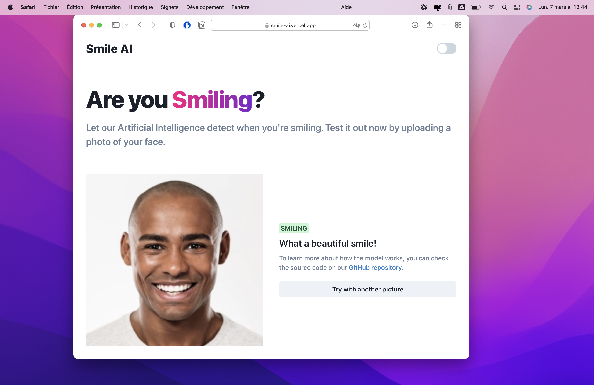
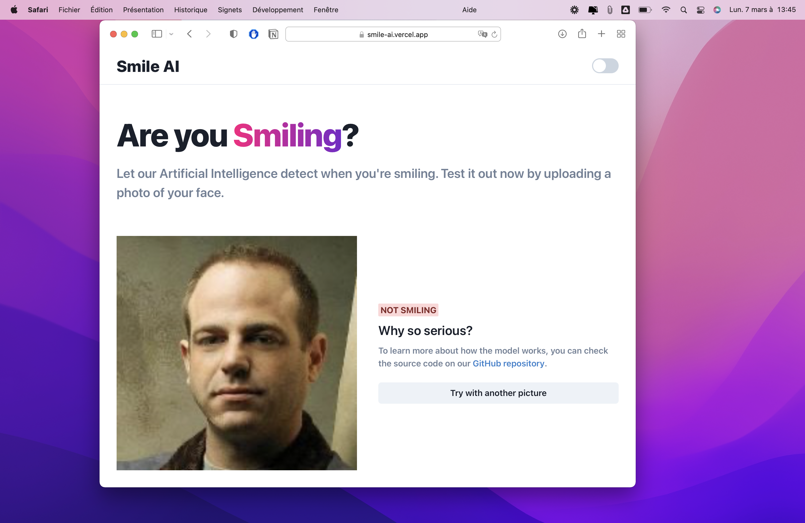

# CNN using CelebA dataset

> 👉 Our model is now live [here](https://smile-ai.vercel.app)!

## 1. Group

- ALLIENNE Maxime
- DERONNE Jules
- DRUON Constant
- HORNAIN Imane
- PROUFF Benjamin

## 2. Report

For this project, we decided to build a model to detect whether a person is attractive or not. But while building our model, we realized a problem. The attractiveness factor is subjective. This subjectivity implies a model with poor performance.

So, to illustrate the problem, we built a second, identical model that detects if someone is smiling. We've choose smile, because it's a objective attribute. And as expected, this model gets much better results.

You can find these 2 models in :

- model/attractiveness.ipynb
- model/smiling.ipynb

In order to run model files, please create a folder `input` inside `/model`. Then download the [CelebA dataset](https://www.kaggle.com/jessicali9530/celeba-dataset), unzip it and add it inside this new folder. Then you're ready to go !

## 3. To go further

Finally, we've decided to **integrate our model into a website**. It's more fun and convenient to classify images in that way!

To do this, we converted the .h5 template into a Tensorflow.js compatible template. Then we created a React.js project that allows to upload a picture (locally only). When the user adds a photo, we predict if the person is smiling or not.

You can test our model on this this [link](https://smile-ai.vercel.app).

